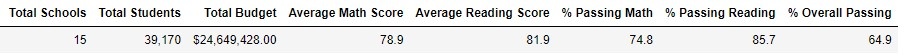

# Module 4: School_District_Analysis

## Overview of Project
The school board notied that there may be academic dishonesty in the Thomas High School ninth grade student's grades. They want to redo the School district analysis without that data and report any changes from original anlaysis.

### Purpose 
The purpose of this challenge is to replace 9th grade student data with NaN and then redo the analysis of the school district data.

## Results
### District Summary

### School Summary

### Top 5 performing schools based on overall passing rate

### Bottom 5 performing schools based on overall passing rate
### Average math score for each grade level for each school
### Average reading score for each grade level for each school
### Scores by school spending by student
### Scores by school size
### Scores by school type

