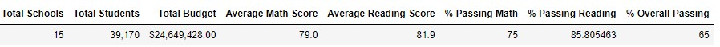
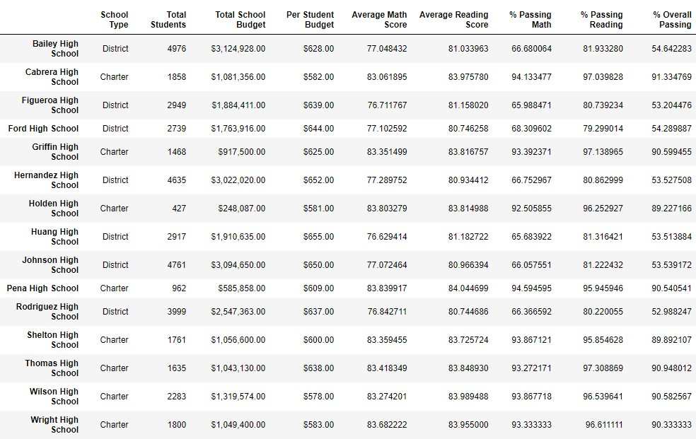
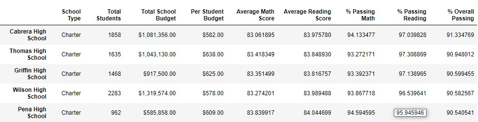
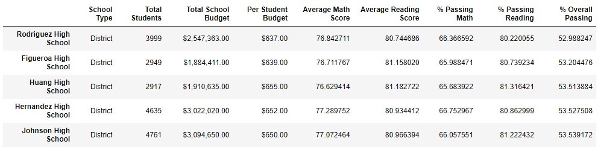

# Module 4: School District Analysis

## Overview of Project
The school board noticed that there may be academic dishonesty in the Thomas High School ninth grade student's grades. They want to redo the School district analysis without that data and report any changes from original analysis.

### Purpose 
The purpose of this challenge is to replace 9th grade student data with NaN and then redo the analysis of the school district data.

## Results
### District Summary
#### Updated data

#### Previous data

The updated district summary above shows that the average reading score was unchanged by removing the 9th grade scores from Thomas High School (THS) however the other scores decreased by about .1

### School Summary
#### Updated Data

#### Previous Data

The updated school summary is all the same except for Thomas High school. The average Math score, % passing math % passing reading and % overall passing all decreased by a small amount, while the average reading score increased by an even smaller amount.

### Top 5 performing schools based on overall passing rate
#### Updated Data

#### Previous Data

The top 5 school order has not changed even though the overall passing rate of Thomas High School decreased by .3%

### Bottom 5 performing schools based on overall passing rate
#### Updated Data

#### Previous Data

The bottom 5 schools did not change

### Average math score for each grade level for each school

### Average reading score for each grade level for each school

The average reading and math scores by grade did not change except for NaNs being inserted in the 9th grade column of Thomas High School

### Scores by school spending by student

### Scores by school size

### Scores by school type

The scores by school spending, by school size and school type did not change with the removal of the 9th grade scores from Thomas High School

## Summary
After removing the math and reading scores for the 9th graders in Thomas High School, the average grades for the school changed by a small amount and it changed the district summary averages by a very small amount. This change was not large enough to affect the spot of Thomas high school in the top 5 schools and it didn’t change the overall scores by school size, type, or spending.

